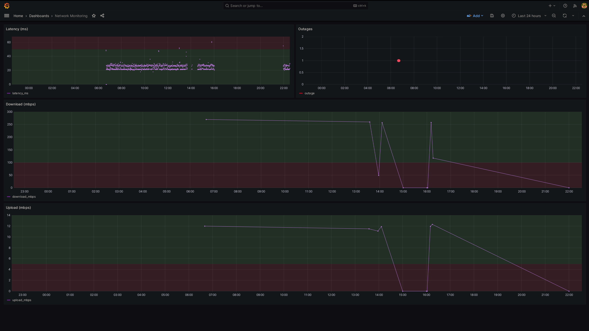

# Network Monitoring

Weekend project to monitor home network, may improve over time. Metric gathering
is done via simple bash scripts, automated via cronjobs in a docker container.

## What's monitored?

| Metric         | Interval |
| :----          | :----    |
| Latency        | 60 sec   |
| Outages        | 60 sec   |
| Upload Speed   | 1 hour   |
| Download Speed | 1 hour   |

## Visualizations

A simple grafana dashboard is used to create some visuals. More visualizations
can be added.

An initial prototype:

## Requirements

Just `docker` and `docker compose`

## Tools Used

TODO: add links, reword

- timescaledb image, because postgres is awesome
- grafana image, for visualizations
- speedtest-cli, gnu-parallel, and postgresql-client packages
    - these are installed on the monitor image
